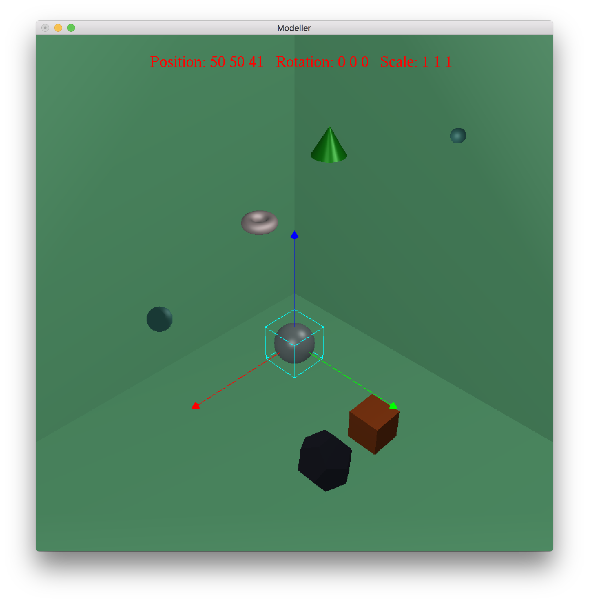

# Simple Modeler (OpenGL/GLUT)
This is a simple 3D modeling system using OpenGL and C++. 

## Functions
1. **Scene Object Structure & Rendering:** All objects are stored in a list. The display loop iterates over the loop.
2. **Adding/Deleting Objects:** You can create an object at a random position of one of the five defined shapes (Cube, Sphere, Cone, Torus, Dodecahedron).
3. **Interacting with Objects:** You can rotate/translate/scale the selected object with some commands.
4. **Mouse-Ray Picking:** This function performs both a ray-plane intersection test and a ray-box intersection test.
  
## Instruction
Under the path of the folder, command `make`

| Controls | Functions |
|----------|:-------------:|
| q/esc | quit |
| SPACE | create an object at a random position |
| Left click | select an object if possible |
| Right click | delete the clicked objects |
| d | delete the selected object, not working if no object is selected |
| r | reset the scene, clear all objects |
| s | save objects to a file, need to type the file name (without .txt) in the console |
| l | load the file and restore objects, need to type the file name (without .txt) in the console |
| u/i | rotate the scene about y |
| o/p | rotate the scene about z |
| g/h | translate the camera in x |
| j/k | translate the camera in y |
| b/n | translate the camera in z |
| x | select/unselect x axis of the selected object, not working if no object is selected |
| y | select/unselect y axis of the selected object, not working if no object is selected |
| z | select/unselect z axis of the selected object, not working if no object is selected |
| UP/DOWN | When an object or a light is selected, translate it in the selected axis, not working if no axis is selected |
| LEFT/RIGHT | When an object or a light is selected, rotate it in the selected axis, not working if no axis is selected |
| +/- | When an object or a light is selected, scale it in the selected axis, not working if no axis is selected |
| 1/2/3/4/5 | change current drawing material |
| m | apply the current drawing material to the selected object, not working if no object is selected |

**Example:** if you want to translate an object in axis x, you should left click this object then press x then press UP or DOWN.

## Remarks
- For some raisons (limits, operations...), the translation is according to the scene's xyz not the selected object itself.
- The selected object will be covered by a wireframe cube and shows its axes x (red), y (green) and z (blue) and the selected axis is cyan.
- At the beginning, the two little sphere represent lights which can be translated.
